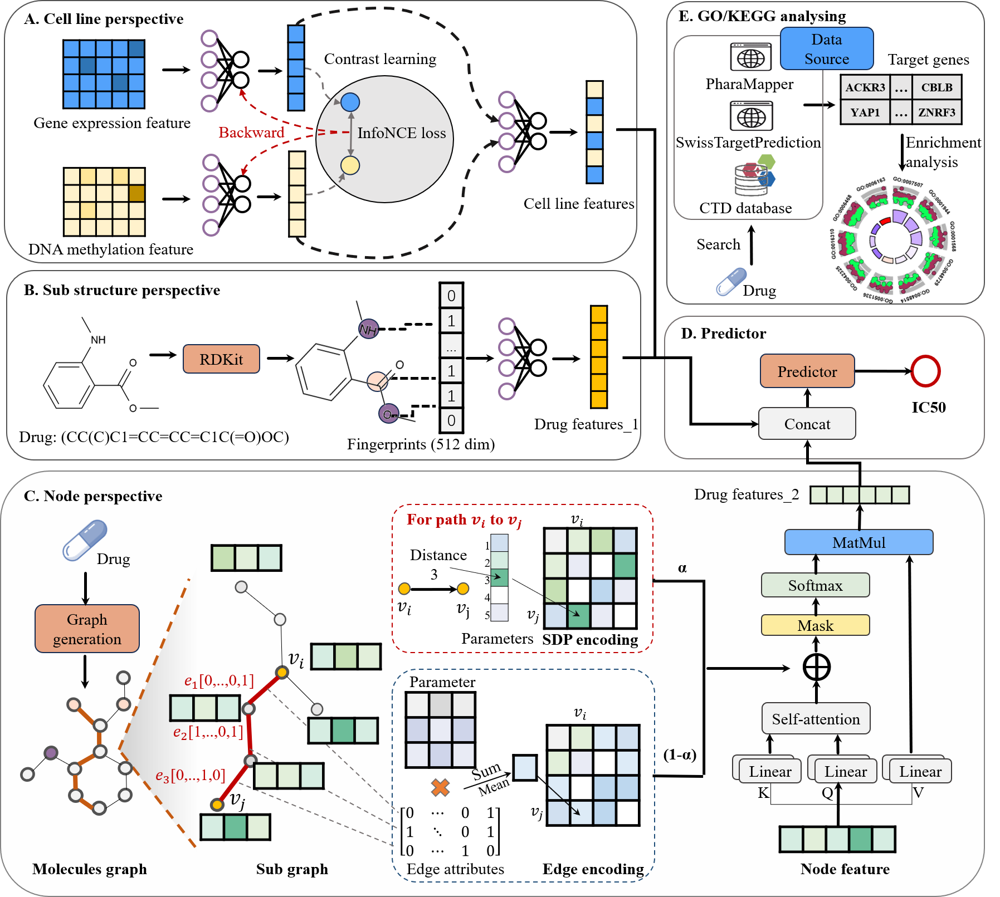
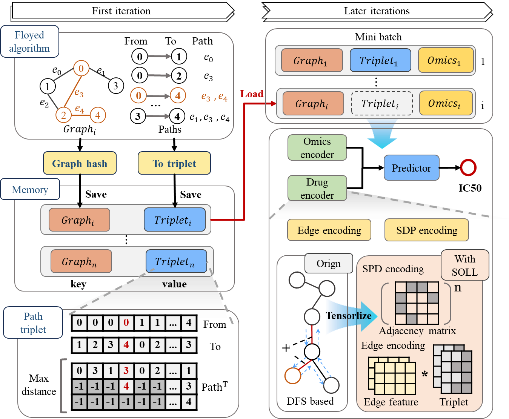
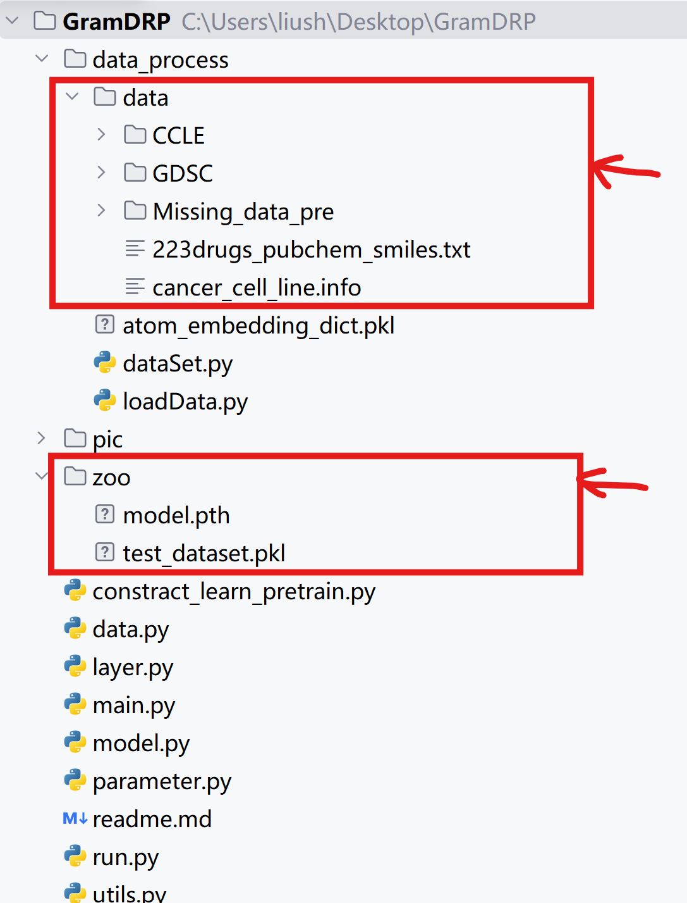

# SADRP
Predicting drug sensitivity across diverse cancer samples  is a fundamental challenge in personalized therapy and drug discovery. This task requires comprehensive characterization of both drug and cancer cell line features. Current approaches often fail to fully capture the complex  structural characteristics interactions of drug compounds   and struggle to effectively integrate multi-omics features derived from the same sample  , limiting their feature representation capacity. Consequently, there is a need for modeling frameworks that can jointly model molecular structural features and multi-modal cellular contexts in a unified manner.  We present SADRP, a structurally  aware multi-modal framework for drug response prediction, designed to model complex molecular structures and multi-omics data. For drug representation, SADRP incorporates Shortest Distance Path (SDP) encoding and edge encoding to capture both topological relationships and bond-type chemical semantics. For cell line profiling, a multi-view interactive encoder integrates gene expression and DNA methylation, effectively capturing cross-omics synergistic complementarity. SADRP consistently outperforms state-of-the-art methods, while also identifying potential therapeutic candidates and potential biomarkers, providing mechanistic insights and supporting applications in drug discovery and personalized medicine.

## Model Structure

<p align="center">
  
</p>
<p align="center"><em>Figure 1: The overall architecture of SADRP</em></p>

<p align="center">
  
</p>
<p align="center"><em>Figure 2: The structure of SOLL module.</em></p>

## 🔧 Dependencies
The following packages are required to run SADRP:
```bash
# Python version
Python >= 3.10

# PyTorch
# change your own CUDA version at torch==2.1.0+cu{CUDA version}
pip install torch>= pip install torch==2.1.0+cu118

# PyTorch Geometric (PyG)
pip install torch-scatter -f https://pytorch-geometric.com/whl/torch-${TORCH}+${CUDA}.html
pip install torch-sparse -f https://pytorch-geometric.com/whl/torch-${TORCH}+${CUDA}.html
pip install torch-cluster -f https://pytorch-geometric.com/whl/torch-${TORCH}+${CUDA}.html
pip install torch-spline-conv -f https://pytorch-geometric.com/whl/torch-${TORCH}+${CUDA}.html
pip install torch-geometric

# RDKit
pip install rdKit

# pickle
pip install pickle
```

## Project structure
The structure of SADRP
```bash
SADRP
   |-----outputs  # back up and train log
   |-----data_process
   |          |--------data  # download here
   |          |          |----- ....
   |          |--------dataSet.py  # dataSet(core codes)
   |          |--------loadData.py  # data cleaning and data process
   |-----pic
   |-----zoo # download here 
   |      |-------model.pth  # our trained state dict
   |      |-------test_dataset.pkl  # test data loader for demo
   |-----data.py  # data loader
   |-----layer.py  # model helper(core codes)
   |-----model.py  # model(core codes)
   |-----main.py  
   |-----demo.py  # run our best model
   |-----constract_learn_pretrain.py  # if train, run it first
   |-----parameter.py  # experiment settings
```
## Data
our dataset is based on DeepCDR，we further refined the dataset by retaining only those drugs with IC50 values available for more than half of the cell lines. The filtering step resulted in a balanced dataset containing **185 drugs** and **561 cell lines**, with a total of **99,594 drug-cell line response pairs**. 
We recommend downloading the dataset via **Baidu Netdisk**.
The data cleaning and alignment logic is implemented in `data_process/loadData.py`.
This script is **automatically invoked** during the train process, so you do not need to run it manually.  

<p align="center">
  
</p>

```bash
# choise 1 (not recommand) use git
https://github.com/kimmo1019/DeepCDR 

# choise 2 (recommand) use pan.baidu
 https://pan.baidu.com/s/1tFbhDC3b-5H4-LUwsJnbaw?pwd=Gram
```

## 🚀 Quick Start
```bash
# this is a small demo
python demo.py
```

## Train model
```bash
# 1. Omic feature constract learning pretrain
python constract_learn_pretrain.py
# then you will see ./pretrained_omics_encoder.pth
# 2. start train
python main.py
```

## Experiments
```bash
in main() in main.py, change here to do differnt experiments
# mix test
train_loader, val_loader, test_loader, _, num_node_features, num_edge_features, _ \
        = loadDrugCellData(args, "save", "single")

# blind test
# To generate the drug blind test split (train/val/test), run the following:
# python ./data_process/loadData.py --func getDrugBlindTestCSVs
# train_loader, val_loader, test_loader, _, num_node_features, num_edge_features, _ \
#     = getDrugBldDataLoader(args, "save", "single")

# To generate the cell blind test split (train/val/test), run the following:
# python ./data_process/loadData.py --func getCellBlindTestCSVs
# train_loader, val_loader, test_loader, _, num_node_features, num_edge_features, _ \
#     = getCellBldDataLoader(args, "save", "single")

# predict NAN response
# train_loader, val_loader, test_loader, _, num_node_features, num_edge_features, _ \
#     = loadExitAndNanDrugCellData(args, "save", "single")

```

## contact me
```bash
 bliu@bliulab.net
shujialiu418@gmail.com
```


